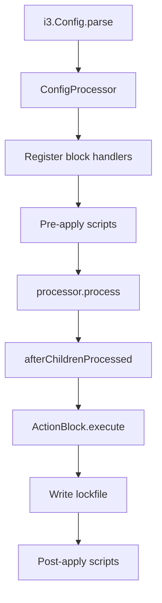

# Architecture Overview

## Core Abstraction: ExecutionService

The central architectural decision in Configr v2 is the **`ExecutionService`**
interface — a transport-layer abstraction that replaces all direct
`Process.run` / `Process.start` calls. Every block handler, package manager,
and file service goes through this single interface.

```dart
abstract class ExecutionService {
  String get platform;
  bool get isConnected;

  Future<ProcessResult> run(
    String command,
    List<String> arguments, {
    String? workingDirectory,
    bool runInShell = false,
    Map<String, String>? environment,
    CommandOutputHandler? onOutput,
    String? stdin,
  });

  Future<void> connect(Map<String, dynamic> config);
  Future<void> disconnect();
  Future<void> putFile(String source, String destination);
  Future<void> fetchFile(String source, String destination);
}
```

### Implementations

| Implementation | Scope | Backend |
|----------------|-------|---------|
| `LocalExecutionService` | Local machine | `dart:io` `Process.run` / `Process.start` |
| `SSHExecutionService` | Remote host | `dartssh2` SSH/SFTP |

## Dependency Injection

Configr uses a lightweight DI container (`package:configr/src/di.dart`).
Services are registered in `_registerAllBlocks()` (in `v2_apply.dart`):

```dart
di
  ..registerSingleton<ExecutionService>(executionService)
  ..registerSingleton<FileSystem>(const LocalFileSystem())
  ..registerSingleton<FileService>(LocalFileService())
  ..registerSingleton<CommandRunner>(const LocalCommandRunner())
  ..registerSingleton<PrivilegeEscalation>(escalation)
  ..registerSingleton<EventBus>(eventBus)
  ..registerSingleton<DryRunFlag>(DryRunFlag(dryRun));
```

The `ExecutionService` selection happens at registration time:
- If `connectionConfig` has a non-empty `host` → `SSHExecutionService`
- Otherwise → `LocalExecutionService`

### Overriding at Runtime

Block handlers can override DI singletons during processing. For example,
the `ConnectionBlock` replaces `LocalExecutionService` with
`SSHExecutionService` when an inline `connection { }` block is processed:

```dart
final ssh = SSHExecutionService();
await ssh.connect(config);
di.allowReassignment = true;
di.registerSingleton<ExecutionService>(ssh);
di.allowReassignment = false;
```

## Secrets Pipeline

```mermaid
flowchart LR
    Config[secrets { } block] --> Parse[Key = URI pairs]
    Parse --> Registry[SecretProviders registry]
    Registry --> Resolver[SecretResolver]
    Resolver --> Provider[Provider.get()]
    Provider --> Sensitive[SensitiveValue wrapper]
    Sensitive --> Middleware[SensitiveVariableMiddleware]
    Middleware --> Context[context.globalContext]
    Context --> Blocks[Other blocks reference secrets.key]
    Context --> Redact[Redaction via middleware.redact()]
```

1. `SecretsBlock.afterChildrenProcessed()` iterates context variables
2. Each value is resolved via `SecretResolver.resolveWithSensitivity()`
3. Resolved values are stored via `context.globalContext.registerBlock()`
4. Sensitive key names are registered with the `SensitiveVariableMiddleware`
5. Other blocks reference secrets via native `secrets.key` dot-notation
6. `emitEvent()` and dry-run `print()` call `middleware.redact()` to replace
   actual sensitive values with `<SENSITIVE>`

## Block Processing Pipeline



## Event System

All operations emit events through `EventBus`. Events carry the block name,
status, message, and metadata. The `FileEventHandler` persists events to a
JSONL log file for audit trails.

Events are automatically redacted before emission — any sensitive values
present in the event message are replaced with `<SENSITIVE>`.

## Key Design Decisions

1. **Single transport interface** — Every OS interaction goes through
   `ExecutionService`, making it trivial to add new transports (e.g.,
   Docker exec, Kubernetes exec, WinRM)

2. **Native BlockReference for secrets** — Secret values use i3config's
   native `secrets.key` dot-notation, not template syntax like `{{ secret }}`.
   No changes needed to existing block subclasses.

3. **Centralised redaction** — Sensitive values are tracked by the
   `SensitiveVariableMiddleware`, which knows the set of sensitive key names and
   their actual values. Redaction happens in two choke points (`emitEvent`
   and dry-run `print`), so no individual block needs to worry about leaking
   secrets. The middleware is registered at the processor level so it
   propagates to all contexts automatically.

4. **DI over globals** — Services are registered in a DI container rather
   than accessed via static globals, making unit testing easier and allowing
   runtime substitution (e.g., swapping `LocalExecutionService` for SSH).
