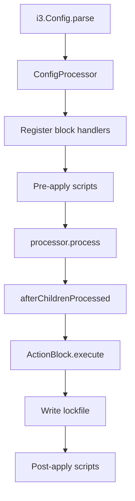

# Architecture Overview

## Core Abstraction: ExecutionService

The central architectural decision in Configr v2 is the **ExecutionService** interface — a transport-layer abstraction that replaces all direct process execution calls. Every block handler, package manager, and file service goes through this single interface.

### Interface

The Execution Service provides:

- `run` — Execute commands with optional environment, working directory, and streaming output
- `connect` / `disconnect` — Manage the transport session
- `putFile` / `fetchFile` — Transfer files between controller and target
- `isConnected` — Check transport readiness
- `platform` — Identify the target operating system

### Implementations

| Implementation | Scope | Backend |
|----------------|-------|---------|
| LocalExecutionService | Local machine | Native process execution |
| SSHExecutionService | Remote host | SSH/SFTP |

Local targets run commands directly through the operating system. Remote targets run commands over an SSH channel, with file transfers handled via SFTP.

### Audited Execution

An audit layer wraps any Execution Service implementation to produce structured logs. Every command invocation is recorded with command, arguments, working directory, timestamps, duration, exit code, and output. PowerShell encoded commands are decoded for readability. Environment variables with sensitive names are redacted automatically.

## Dependency Injection

Configr uses a lightweight DI container. Services are registered at startup:

- ExecutionService is bound to either LocalExecutionService or SSHExecutionService
- FileSystem and FileService handle local file operations
- CommandRunner handles local command execution
- PrivilegeEscalation handles sudo/pkexec integration
- EventBus handles application events

The Execution Service selection is automatic:
- If a connection host is configured → SSHExecutionService
- Otherwise → LocalExecutionService

### Overriding at Runtime

Block handlers can override services during processing. For example, when an inline connection block is processed, the local execution service is replaced with an SSH execution service for the remainder of the run.

## Secrets Pipeline

```mermaid
flowchart LR
    Config[secrets { } block] --> Parse[Key = URI pairs]
    Parse --> Registry[SecretProviders registry]
    Registry --> Resolver[SecretResolver]
    Resolver --> Provider[Provider.get()]
    Provider --> Sensitive[SensitiveValue wrapper]
    Sensitive --> Middleware[SensitiveVariableMiddleware]
    Middleware --> Context[context.globalContext]
    Context --> Blocks[Other blocks reference secrets.key]
    Context --> Redact[Redaction via middleware.redact()]
```

1. The secrets block iterates context variables after children are processed
2. Each value is resolved through the secret resolver with sensitivity metadata
3. Resolved values are stored in the global context
4. Sensitive key names are registered with the middleware
5. Other blocks reference secrets via native dot-notation
6. Events and dry-run output are redacted automatically

## Block Processing Pipeline



## Event System

All operations emit events through an event bus. Events carry the block name, status, message, and metadata. A file event handler persists events to a JSONL log file for audit trails.

Events are automatically redacted before emission — any sensitive values present in the event message are replaced with a placeholder.

## Key Design Decisions

1. **Single transport interface** — Every OS interaction goes through the Execution Service, making it straightforward to add new transports.
2. **Native secret references** — Secret values use native dot-notation, not template syntax. No changes needed to existing block subclasses.
3. **Centralised redaction** — Sensitive values are tracked by a middleware component registered at the processor level so it propagates to all contexts automatically.
4. **DI over globals** — Services are registered in a DI container rather than accessed via static globals, making unit testing easier and allowing runtime substitution.
