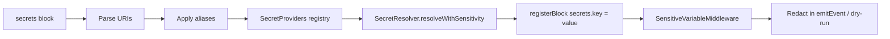

# Secrets Management

Configr includes a provider-agnostic secrets system for resolving sensitive
values at apply time without hardcoding them in config files.

## Overview

Secrets are configured via the `secrets { }` block in your i3config. Each key
is set to a **URI** that identifies what provider to use and what value to fetch.
Resolved values are stored in the config context as `secrets.<key>` and can be
referenced by any other block using native dot-notation `BlockReference` syntax.

Sensitive values are automatically **redacted** from logs, events, and dry-run
output (replaced with `<SENSITIVE>`).

## Basic Usage

```i3
secrets {
    profile = "personal"
    provider "github" = "env://GITHUB_TOKEN"
    provider "docker" = "file:///run/secrets/docker_hub_key"

    db_password = "env://DB_PASSWORD"
    api_key    = "cmd://vault kv get -field=value secret/myapp/api"
}
```

## Secret Providers

| Provider | URI Scheme | Description |
|----------|------------|-------------|
| Environment | `env://KEY_NAME` | Reads from environment variables |
| File | `file:///path/to/file` | Reads first line of a file |
| Dotenv | `dotenv:///path/to/.env` | Reads a key from a `.env` file |
| Command | `cmd://command` | Captures stdout of a command |
| 1Password | `onepassword://item/field` | Fetches from 1Password CLI (`op`) |
| Keyring | `keyring://service/key` | Uses system keyring (`secret-tool`) |

## Provider Aliases

The `provider` subcommand maps an alias to a URI prefix, so you can write
shorter references:

```i3
secrets {
    profile = "work"
    provider "prod" = "env://"
    provider "staging" = "file:///run/secrets/"

    db_password = "prod://DB_PASSWORD"
    api_key     = "staging://api_key"
}
```

## Referencing Secrets

Once resolved, secrets are available as `secrets.<key>` using native i3config
dot-notation:

```i3
execute {
    command = "deploy --token ${secrets.api_key}"
}

copy {
    source = "db.conf.template"
    destination = "/app/db.conf"
    content = "password=${secrets.db_password}"
}
```

## Sensitive Value Redaction

All secrets marked as sensitive are registered with the
`SensitiveVariableMiddleware`, which is injected into all i3config contexts
at the processor level. When events are emitted or dry-run output is printed,
any occurrence of a sensitive value in the message is automatically replaced with
`<SENSITIVE>`. Values shorter than 4 characters are not redacted to avoid
false positives.

```i3
# This password will appear as <SENSITIVE> in logs
secrets {
    db_password = "env://DB_PASSWORD"
}

execute {
    command = "psql -c 'CREATE USER app WITH PASSWORD \"${secrets.db_password}\"'"
}
# Log: psql -c 'CREATE USER app WITH PASSWORD "<SENSITIVE>"'
```

## Profiles

The `profile` parameter is forwarded to the provider's `get()` method.
Providers may use it for context — for example, a `cmd://` provider could
select among different secrets based on profile:

```i3
secrets {
    profile = "production"
    provider "vault" = "cmd://vault kv get -field=value -mount=secret/"

    db_password = "vault://${profile}/db"
}
```

## Configuration Properties

| Property | Type | Description |
|----------|------|-------------|
| `profile` | string | Profile forwarded to provider `get()` |
| `provider "<alias>" = "<uri>"` | subcommand | Maps alias to URI prefix |
| `<key> = "<uri>"` | assignment | Resolves key via the URI |

## How It Works


