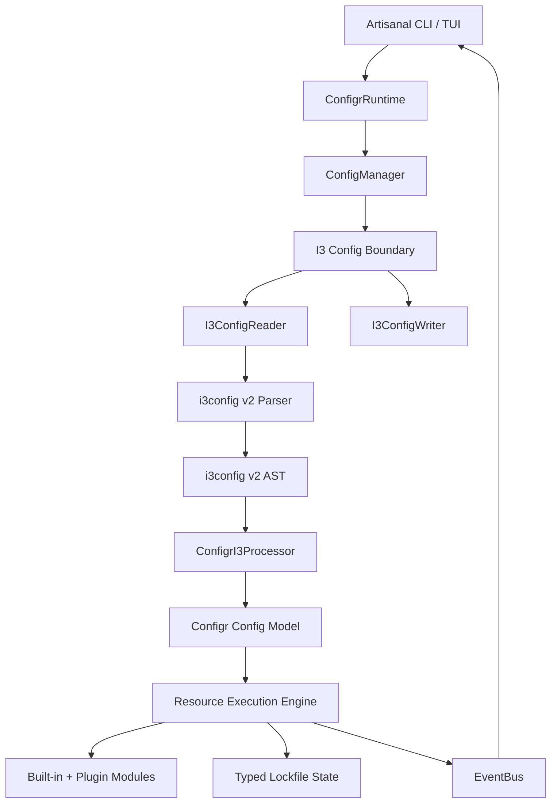

# Configr v2 Migration Plan

## Why v2?

Configr v1.0.0 has significant architectural debt that limits its utility as both a CLI tool and a library:

- **No public library API**: `lib/configr.dart` previously exposed no useful package API, so other Dart packages could not consume Configr programmatically.
- **Singleton abuse**: `ConfigManager`, `EventBus`, `PluginRegistry`, and `PluginManager` have historically relied on global ownership, making tests brittle and state leaks likely.
- **Manual i3 processing**: Configr currently converts i3-like text through hand-written model conversion and ad-hoc traversal. This duplicates work that `i3config` v2 now provides as a full parser + processor state machine.
- **Weak typing throughout**: Module state is still `Map<String, dynamic>`, action types are raw strings, and resource types are string constants.
- **Dead plugin system**: Plugin scaffolding exists, but loading/execution is not wired into the real configuration processing flow.
- **CLI framework mismatch**: The project has started adding `artisanal`, but the executable still uses `package:args`-style `CommandRunner` code and legacy UI paths.
- **No clean i3 format boundary**: JSON/i3 support exists in utility functions, but v2 should first establish a durable i3 reader/writer pipeline around the `i3config` v2 AST and processor.

## Goals

- Treat `i3config` v2 as the canonical parser and processing engine for Configr’s i3-style configuration format.
- Model Configr’s i3 syntax through `i3config` v2 `Config`, `Block`, `Command`, `Value`, `ConfigProcessor`, `BlockHandler`, and `CommandHandler` concepts instead of manual traversal.
- Deliver a proper Dart library (`package:configr`) with a clean public API and a testable dependency-injected runtime.
- Keep the CLI as a thin Artisanal-powered consumer of the library.
- Focus v2 format work on i3 only, with `i3config` v2 as the source of truth for parsing and processing.
- Strengthen types for actions, modules, resources, and persisted rollback state.
- Make plugins register resource/action handlers into the same processing pipeline used by built-in modules.

## Key Decisions

- **i3 parser/processor**: Use `package:i3config/i3config.dart` (v2 default) rather than legacy `i3config_v1.dart` or custom parsing.
- **i3 state machine integration**: Configr i3 loading should parse to an `i3config` v2 AST, then process that AST through a Configr-specific `ConfigProcessor` setup.
- **Block-handler-first DSL mapping**: Configr’s DSL (`resources`, `file`, `directory`, `actions`, action blocks, `commands`, `packages`, scripts) should be represented with `i3config` v2 `BlockHandler`s, block-scoped `CommandHandler`s, and block-scoped `BlockHandler`s — not independent parsing or manual recursive traversal.
- **Library model boundary**: The public Configr model remains domain-focused (`Config`, `ResourceModel`, `Action`, lockfile/state types), but i3 input/output goes through an adapter layer backed by the `i3config` v2 AST.
- **Console UI**: Replace `interact` with `artisanal` for styled console output and interactive workflows.
- **CLI framework**: Replace `package:args` command runner usage with Artisanal’s runner from `package:artisanal/args.dart`.
- **Interactive mode**: Rewrite interactive flows using Artisanal’s TUI/runtime APIs where they provide value; do not put parsing or business logic in the TUI layer.
- **Format support**: i3 is the only active v2 format target. JSON/YAML support is deferred until the i3 state-machine pipeline is stable.

## Non-Goals

- Do not write a new i3 grammar or parser.
- Do not continue expanding Configr’s manual i3 parsing/traversal utilities except as temporary migration shims.
- Do not rewrite every resource module in the first pass; keep existing `ResourceModule` implementations working behind typed adapters where possible.
- Do not change the user-facing config syntax unless required by the `i3config` v2 grammar; preserve v1 configs where practical.
- Do not remove rollback or lockfile functionality.
- Do not make the Artisanal UI responsible for domain execution; UI observes and renders library events.

## Current Reality Check

Known from the current repository state:

- `pubspec.yaml` already includes `artisanal: ^0.3.0` and `i3config: ^2.1.0`.
- `pubspec.yaml` still includes `interact: ^2.2.0`, which should be removed after UI migration.
- `bin/main.dart` and `cli/command_runner.dart` still import `package:args/command_runner.dart`; these need to move to `package:artisanal/args.dart`.
- `lib/utils/config.dart` currently detects JSON vs i3 and calls `parseConfig(contents)` for i3.
- Existing model serialization (`Config.toConfig()`, `ResourceModel.toConfig()`, `Action.toConfig()`) manually emits i3-like text and should be replaced or isolated behind `I3ConfigWriter`.
- `i3config` v2 exposes the pieces Configr should build on: `Config.parse`, `Parser.parseWithDetails`, source spans, sealed AST classes, `ConfigProcessor`, processor states, `BlockHandler`, `CommandHandler`, `registerBlockHandler`, `registerCommandHandler`, `registerBlockScopedCommandHandler`, and `registerBlockScopedBlockHandler`.

## Target Architecture



### i3 Processing Pipeline

The i3 path should become:

1. Read text from disk.
2. Parse with `i3config` v2 using `Parser.parseWithDetails(contents, url: Uri.file(path))` or `Config.parse(contents, url: ...)` where detailed errors are not needed.
3. Process the AST with a Configr-owned processor setup:
   - built-in `i3config` behavior remains available (`set`, `include`, variable expansion),
   - Configr registers `BlockHandler`s for top-level sections such as `resources`, `commands`, `packages`, `pre_apply_scripts`, and `post_apply_scripts`,
   - Configr registers block-scoped `BlockHandler`s for nested blocks such as `resources -> file`, `resources -> directory`, `resource -> actions`, and `actions -> copy/delete/backup/...`,
   - Configr registers block-scoped `CommandHandler`s for properties/commands that are only valid inside specific blocks, such as `file.source`, `file.destination`, `file.template`, action properties, and package/script entries,
   - handlers build a typed intermediate builder rather than mutating global state.
4. Materialize the domain `Config` model from the builder.
5. Execute through `ConfigManager` and resource modules.

### Format Boundary

```dart
abstract interface class ConfigReader {
  Future<Config> read(ConfigSource source);
}

abstract interface class ConfigWriter {
  Future<String> write(Config config);
}
```

- `I3ConfigReader` owns `i3config` v2 parsing and processing.
- `I3ConfigWriter` owns domain model → i3config AST/text serialization.
- Keep the `ConfigReader`/`ConfigWriter` boundary small enough that JSON/YAML can be added later, but do not implement or migrate those formats during the current v2 pass.

## Phases

### Phase 0: Stabilize Migration Baseline

Create a safe baseline before deeper refactors.

- [ ] 0.1 Run `dart analyze` and record existing diagnostics without trying to fix unrelated issues.
- [ ] 0.2 Run the current focused test suite and record known failures.
- [ ] 0.3 Identify all active manual i3 parsing/conversion entry points (`parseConfig`, `toConfig`, `loadConfig`, `updateConfig`, command `format`, command `add`).
- [ ] 0.4 Confirm no code imports `package:i3config/i3config_v1.dart`; v2 should be the default import.

### Phase A: Library API Foundation

Introduce a proper `package:configr` library surface while keeping CLI code separate.

- [ ] A.1 Replace `lib/configr.dart` with a barrel export file exposing public Configr types.
- [ ] A.2 Move implementation internals under `lib/src/` or clearly mark private implementation files.
- [ ] A.3 Keep CLI bindings out of public library exports.
- [ ] A.4 Resolve duplicated command implementations between `lib/commands/` and `cli/commands/`.
- [ ] A.5 Fix spelling: rename `privellage_escallation.dart` → `privilege_escalation.dart`, update all references.
- [ ] A.6 Update `pubspec.yaml` description from `"A sample command-line application."` to a meaningful package description.
- [ ] A.7 Verify `dart doc` generates documentation for the public API without exposing CLI internals.

### Phase B: i3config v2 Reader and Processor

Replace manual i3 loading with an `i3config` v2-backed reader and state-machine processing layer.

- [ ] B.1 Define `I3ConfigReader` that uses `package:i3config/i3config.dart` and `Parser.parseWithDetails` for user-facing diagnostics.
- [ ] B.2 Add `ConfigrI3Processor` or `ConfigrI3ProcessingPipeline` that owns a configured `ConfigProcessor` instance.
- [ ] B.3 Add a domain builder, e.g. `ConfigBuilder`, that handlers mutate while processing AST nodes.
- [ ] B.4 Implement top-level Configr section `BlockHandler`s:
  - [ ] `ResourcesBlockHandler`
  - [ ] `CommandsBlockHandler`
  - [ ] `PackagesBlockHandler`
  - [ ] `PreApplyScriptsBlockHandler`
  - [ ] `PostApplyScriptsBlockHandler`
- [ ] B.5 Implement resource `BlockHandler`s for `file`, `directory`, and future resource types.
- [ ] B.6 Register resource handlers as block-scoped block handlers under `resources` using `registerBlockScopedBlockHandler`.
- [ ] B.7 Implement `ActionsBlockHandler` and register it as a block-scoped block handler under each resource block type.
- [ ] B.8 Implement action `BlockHandler`s for existing built-in action types (`backup`, `copy`, `delete`, `permissions`, `symlink`, `compress`, `decompress`, `download`, `execute`, etc.) and register them as block-scoped block handlers under `actions`.
- [ ] B.9 Implement block-scoped `CommandHandler`s for resource/action/package/script properties instead of reading arbitrary command lists manually.
- [ ] B.10 Use handler `registerScopedCommands` methods where possible so each block owns the commands and child blocks valid inside it.
- [ ] B.11 Use i3config `Context`/value expansion for variables instead of custom string unquoting where possible.
- [ ] B.12 Preserve parse source spans in Configr diagnostics so errors can report file, line, and column.
- [ ] B.13 Add tests for representative v1 config files parsed through the new i3 state-machine pipeline.

### Phase C: i3 Writer and Formatting

Stop relying on scattered `toConfig()` methods as the primary i3 serializer.

- [ ] C.1 Define `I3ConfigWriter` as the only supported domain model → i3 text path.
- [ ] C.2 Decide whether the writer builds an `i3config` v2 AST first or directly writes text from domain models. Prefer AST-backed output if it preserves ordering and quoting better.
- [ ] C.3 Centralize quoting, escaping, indentation, and block ordering rules in the writer.
- [ ] C.4 Keep existing `toConfig()` methods only as deprecated shims or remove them after call sites migrate.
- [ ] C.5 Update `format` to parse through `I3ConfigReader` and write through `I3ConfigWriter`.
- [ ] C.6 Add round-trip tests for parse → domain model → write → parse.
- [ ] C.7 Add tests for comments/source-span behavior if comments are preserved; otherwise explicitly document comment preservation limitations.

### Phase D: i3 Format Boundary

Make the i3 reader/writer boundary clean without implementing JSON/YAML in this pass.

- [ ] D.1 Define minimal `ConfigReader` and `ConfigWriter` interfaces around the i3 pipeline.
- [ ] D.2 Define `ConfigSource`/`ConfigSink` metadata objects that carry path, URI, and file system access.
- [ ] D.3 Implement a simple i3-only format service or registry that always resolves extensionless `config` files and `.i3`/`.conf`-style files to `I3ConfigReader`/`I3ConfigWriter`.
- [ ] D.4 Register `I3ConfigReader`/`I3ConfigWriter` as the default and only active reader/writer.
- [ ] D.5 Update `loadConfig()`, `updateConfig()`, `exportConfiguration()`, `init`, `add`, and `format` to use the i3 boundary.
- [ ] D.6 Keep the API shape compatible with future JSON/YAML readers, but do not implement JSON/YAML now.
- [ ] D.7 Keep i3 as the default for new files and extensionless `config` files.

### Phase E: Dependency Injection and Runtime Ownership

Break global ownership and make the i3 reader/writer boundary, processor, UI, and modules injectable.

- [ ] E.1 Define/finish `ConfigrConfig` as the single runtime configuration object.
- [ ] E.2 Include the i3 reader/writer boundary, file system, event bus, privilege escalation, plugin directories, UI handler, and execution options in `ConfigrConfig`.
- [ ] E.3 Make `ConfigManager` accept `ConfigrConfig` via constructor and avoid singleton state.
- [ ] E.4 Make `EventBus` accept an optional `StreamController` via constructor and remove global event helpers.
- [ ] E.5 Make plugin/module registries runtime-owned rather than global singletons.
- [ ] E.6 Update tests to create isolated `ConfigrConfig` instances per test.
- [ ] E.7 Keep any temporary backward-compat constructor/factory clearly deprecated and internally isolated.

### Phase F: Strong Domain Types

Use stronger types after the i3 state-machine reader is in place so handlers can produce the right model directly.

- [ ] F.1 Define `ActionType` as a sealed class or enum-like value object that supports built-in and plugin-defined types.
- [ ] F.2 Define `ResourceType` as a sealed class or extensible value object replacing `ResourceType.file`/`directory` string constants.
- [ ] F.3 Define `ModuleState` typed classes for persisted rollback/module state.
- [ ] F.4 Update `Action` so `type` and `state` are typed internally while retaining compatibility with existing persisted model data.
- [ ] F.5 Update `ResourceModel` so `type` is typed internally while retaining config compatibility.
- [ ] F.6 Replace action switch statements with an injected registry mapping `ActionType` → module factory/handler.
- [ ] F.7 Add typed `ModuleState` serialization/deserialization to `LockfileData`.
- [ ] F.8 Migrate built-in modules one at a time, with tests per module.

### Phase G: Plugin System on the Same Handler Pipeline

Make plugins useful by letting them extend the same registries used by built-in resource/action handlers.

- [ ] G.1 Define a `Plugin` API with `init(ConfigrRuntime runtime)` or equivalent dependency access.
- [ ] G.2 Let plugins register action types, resource types, i3 `BlockHandler`s, block-scoped `CommandHandler`s, block-scoped `BlockHandler`s, and module factories.
- [ ] G.3 Implement plugin discovery from configured plugin directories.
- [ ] G.4 Wire plugin loading into runtime initialization before config processing.
- [ ] G.5 Implement isolate execution only where out-of-process plugin execution is actually needed; keep in-process registration simple first.
- [ ] G.6 Add `--plugin-dir` to the Artisanal CLI and `ConfigrConfig.pluginDirs` to the runtime.
- [ ] G.7 Write an integration test for a minimal plugin that adds a custom action block parsed through the i3config v2 processor.

### Phase H: Artisanal CLI Migration

Replace `args` and legacy prompt usage with Artisanal while keeping command behavior backed by the library.

- [ ] H.1 Replace imports of `package:args/command_runner.dart` with Artisanal’s `package:artisanal/args.dart` APIs.
- [ ] H.2 Remove direct dependence on `interact` after equivalent prompts/output exist in Artisanal.
- [ ] H.3 Rewrite `ConfigrCommandRunner` as an Artisanal command runner with global options:
  - [ ] `--config` / `-c`
  - [ ] `--interactive` / `-i`
  - [ ] `--verbose` / `-v`
  - [ ] `--debug` / `-d`
  - [ ] `--dry-run`
  - [ ] `--generate-completion`
  - [ ] `--plugin-dir`
- [ ] H.4 Make each CLI command construct or receive `ConfigrConfig`, then call library services.
- [ ] H.5 Rewrite `CliHandler` using Artisanal console styling, tables, status blocks, and progress indicators.
- [ ] H.6 Rewrite `InteractiveHandler` using Artisanal TUI/runtime APIs where real-time interaction is needed.
- [ ] H.7 Keep command completion generation working or replace it with Artisanal-supported completion output.
- [ ] H.8 Verify `dart run configr --help` and each subcommand help render correctly.

### Phase I: CLI / Library Separation

Refine command boundaries once the Artisanal runner is in place.

- [ ] I.1 Move CLI-only command runner code under `cli/` or `bin/` and keep it out of `lib/configr.dart` exports.
- [ ] I.2 Move reusable command behavior into library services, not `CommandRunner` subclasses.
- [ ] I.3 `BaseCommand`/command services should receive `ConfigrConfig` or `ConfigrRuntime` rather than reading global manager instances.
- [ ] I.4 Remove CLI-specific imports from `lib/` domain and module code.
- [ ] I.5 Verify `dart run configr` still supports v1 command workflows.
- [ ] I.6 Verify library consumers can load/apply configs without importing CLI code.

### Phase J: Watch & Live Reload

Add watching after runtime ownership and format processing are stable.

- [ ] J.1 Implement `ConfigWatcher` using `dart:io` file watching first unless a package is clearly needed.
- [ ] J.2 Watch the main config file and any included files discovered by the i3config include handler.
- [ ] J.3 Debounce change events and avoid overlapping applies.
- [ ] J.4 Integrate with `ConfigManager`/runtime to re-read through the i3 config boundary and re-apply.
- [ ] J.5 Add `configr watch` command.
- [ ] J.6 Add `configr apply --watch` flag.
- [ ] J.7 Surface watch status through Artisanal UI events.

### Phase K: Privilege Escalation Persistence

Absorb the existing privilege escalation proposal into the injected runtime.

- [ ] K.1 Create session-based `PrivilegeLock` / privilege lease type.
- [ ] K.2 Add privilege lock caching/timeout settings to `ConfigrConfig`.
- [ ] K.3 Route all privileged module operations through the injected escalation service.
- [ ] K.4 Persist or reuse privilege state only within explicitly configured safety bounds.
- [ ] K.5 Add tests covering timeout, invalidation, and non-interactive failure behavior.

## Migration Strategy

### Implementation Order

1. **Do Phase 0 first** to establish a known baseline.
2. **Prioritize Phases A–D** because they define the new core: public API + i3config v2 state-machine reader/writer + i3 format boundary.
3. **Do Phase E after the format pipeline** so dependency injection reflects the real runtime shape.
4. **Do Phase F after the reader is producing stable domain models** to avoid typing the wrong abstractions.
5. **Do Phases G–I** once the library/runtime boundary is clean enough for plugins and the CLI to consume.
6. **Do Phases J–K** as follow-up v2.x capabilities unless they become blockers.

### Branching

- Work on a `v2` branch until the i3config v2 pipeline, dependency injection, and Artisanal CLI are stable.
- Merge incremental PRs into `v2` by phase or by vertical slice.
- Merge `v2` → `main` as a single v2.0.0 release once i3 parsing, execution, rollback, and core CLI commands are validated.
- Plugin, watch, and privilege persistence work can ship in v2.1+ if necessary.

### Backward Compatibility

- Existing v1 i3-style config files should continue to load unmodified where they are valid under `i3config` v2 grammar.
- Extensionless `config` files remain i3 by default.
- JSON/YAML are not v2 migration targets right now. Existing JSON model helpers can remain as compatibility utilities, but new v2 config loading/writing should focus on i3.
- Any compatibility shim for old constructors or static managers must be explicitly deprecated and backed by isolated runtime instances.
- If comment preservation changes during i3 read/write, document it clearly before release.

### Testing

- Add parser/processor tests around Configr-specific i3 syntax before removing manual parsing.
- Add fixture-based tests for real v1 config files.
- Add round-trip tests for i3 parse/write/parse behavior.
- Defer JSON/YAML reader/writer tests until those formats are reintroduced.
- Add CLI smoke tests for Artisanal command parsing and help output.
- Add module execution tests that prove the state-machine-produced domain model executes exactly like the old manually parsed model.
- Add lockfile migration tests once typed module state lands.

## Risks

| Risk | Mitigation |
|------|------------|
| `i3config` v2 grammar rejects existing Configr config syntax | Build fixture tests first; adjust Configr syntax handlers where possible; only change user syntax with explicit migration notes. |
| State-machine integration becomes too coupled to `i3config` internals | Depend only on public exports from `package:i3config/i3config.dart`; isolate integration in `I3ConfigReader`/processor classes; use public handler registration APIs (`registerBlockHandler`, `registerBlockScopedCommandHandler`, `registerBlockScopedBlockHandler`). |
| Writer loses comments or formatting | Decide and test preservation requirements early; document any intentional limitation before v2 release. |
| DI refactor breaks many call sites | Do after the i3 pipeline is shaped; update call sites in focused vertical slices. |
| Plugin API is designed before the real handler pipeline stabilizes | Make plugin registration extend the same registries built for built-ins; delay isolate complexity until basic registration works. |
| Artisanal migration changes command behavior | Add CLI smoke tests before replacing the runner; keep command service logic independent from the runner. |
| JSON/YAML work distracts from the i3 state-machine migration | Defer JSON/YAML until the i3 reader/writer and execution pipeline are stable. |
