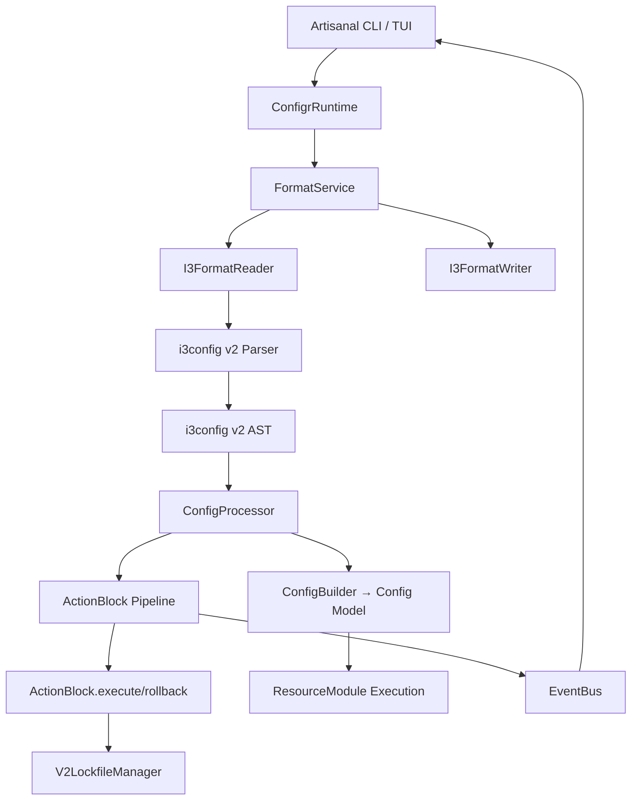

# Configr v2 Migration Plan

## Why v2?

Configr v1.0.0 has significant architectural debt that limits its utility as both a CLI tool and a library:

- **No public library API**: `lib/configr.dart` previously exposed no useful package API, so other Dart packages could not consume Configr programmatically.
- **Singleton abuse**: `ConfigManager`, `EventBus`, `PrivilegeLock` have historically relied on global ownership, making tests brittle and state leaks likely.
- **Manual i3 processing**: Configr v1 converts i3-like text through hand-written model conversion and ad-hoc traversal. This duplicates work that `i3config` v2 now provides as a full parser + processor state machine.
- **Weak typing throughout**: Module state is still `Map<String, dynamic>`, action types are raw strings, and resource types are string constants.
- **Dead plugin system**: Plugin scaffolding exists, but loading/execution is not wired into the real configuration processing flow.
- **CLI framework mismatch**: The project has started adding `artisanal`, but the executable still uses legacy UI paths.
- **No clean i3 format boundary**: JSON/i3 support exists in utility functions, but v2 should first establish a durable i3 reader/writer pipeline around the `i3config` v2 AST and processor.

## Goals

- Treat `i3config` v2 as the canonical parser and processing engine for Configr's i3-style configuration format.
- Model Configr's i3 syntax through `i3config` v2 `Config`, `Block`, `Command`, `Value`, `ConfigProcessor`, `BlockHandler`, and `CommandHandler` concepts instead of manual traversal.
- Deliver a proper Dart library (`package:configr`) with a clean public API and a testable dependency-injected runtime.
- Keep the CLI as a thin Artisanal-powered consumer of the library.
- Focus v2 format work on i3 only, with `i3config` v2 as the source of truth for parsing and processing.
- Strengthen types for actions, modules, resources, and persisted rollback state.
- Make plugins register resource/action handlers into the same processing pipeline used by built-in modules.

## Key Decisions

- **i3 parser/processor**: Use `package:i3config/i3config.dart` (v2 default) rather than legacy `i3config_v1.dart` or custom parsing.
- **i3 state machine integration**: Configr i3 loading should parse to an `i3config` v2 AST, then process that AST through a Configr-specific `ConfigProcessor` setup.
- **Block-handler-first DSL mapping**: Configr's DSL (`resources`, `file`, `directory`, `actions`, action blocks, `commands`, `packages`, scripts) should be represented with `i3config` v2 `BlockHandler`s, block-scoped `CommandHandler`s, and block-scoped `BlockHandler`s — not independent parsing or manual recursive traversal.
- **ActionBlock as the unified primitive**: Every config action (copy, delete, download, etc.) is an `ActionBlock` subclass — it is both the i3 handler AND the execution module. No separate model object or collector pattern in v2.
- **UUID block IDs**: Every unnamed block gets a UUID v4 for unique identification in the lockfile. UI displays block type names from event messages, not UUIDs.
- **Format Boundary**: Abstract `ConfigReader`/`ConfigWriter` interfaces + `FormatService` registry for resolving readers/writers by file extension. Currently i3-only; JSON/YAML readers implement the same interfaces.
- **Console UI**: Use `artisanal` for styled console output and interactive workflows. All output uses `io.title()`, `io.section()`, `io.success()`, etc.
- **Interactive mode**: Rewrite interactive flows using Artisanal's TUI/runtime APIs where they provide value; do not put parsing or business logic in the TUI layer.
- **Format support**: i3 is the only active v2 format target. JSON/YAML support is deferred until the i3 state-machine pipeline is stable.

## Non-Goals

- Do not write a new i3 grammar or parser.
- Do not continue expanding Configr's manual i3 parsing/traversal utilities except as temporary migration shims.
- Do not rewrite every resource module in the first pass; keep existing `ResourceModule` implementations working behind typed adapters where possible.
- Do not change the user-facing config syntax unless required by the `i3config` v2 grammar; preserve v1 configs where practical.
- Do not remove rollback or lockfile functionality.
- Do not make the Artisanal UI responsible for domain execution; UI observes and renders library events.

## Current Reality Check

- **`artisanal` is installed** (`^0.3.0`) and the CLI uses it fully (`bin/configr.dart`, `cli/commands/*.dart`). `interact` dependency has been removed.
- **`i3config: ^2.1.0`** is the installed version. No code imports `i3config_v1.dart`.
- **`lib/configr.dart`** is a barrel export of public types. Implementation code is under `lib/src/`.
- **`bin/configr.dart`** is the working entry point. `bin/a.dart` and `bin/main.dart` have been deleted.
- **All 21 action blocks** are ported to `ActionBlock` subclasses in `lib/src/blocks/`.
- **Format boundary** exists: `ConfigReader`/`ConfigWriter` abstract interfaces, `ConfigSource`/`ConfigSink` metadata, `I3FormatReader`/`I3FormatWriter`, and `FormatService` registry at `lib/src/format/`.
- **V2 lockfile** (`config.lock.json`) with friendly block names (`download_0`, `copy_1`) instead of UUIDs. Rollback uses property-based matching (source+destination) for reliable cross-run identification.
- **`PrivilegeLock`** is now instance-based with configurable timeout (no more singleton).
- **Zero analyze errors** project-wide (down from 95+). All v2 tests pass (97 tests).
- **Friendly block names**: Blocks without explicit IDs get generated names like `download_0`, `copy_1` instead of UUIDs. `package:uuid` dependency removed.
- **All 33 example configs parse and process** with `--v2`. Previously-failing examples fixed by:
  - Replacing `[...]` array syntax with comma-separated strings (i3config v2 parser limitation)
  - Fixing property name mismatches (v1 `include_patterns` → v2 `include`, etc.)
- **Upstream issue created**: `[...]` array/list syntax not supported in i3config v2 parser (minimal failing cases in `examples/upstream_issue.dart`, report at `upstream_issue_report.md`).
- Remaining: plugin isolation (isolate loading), comment preservation in writer.

## Target Architecture



### i3 Processing Pipeline (v2)

1. Read text from disk via `FormatService`.
2. Parse with `i3config` v2 using `Config.parse(contents)`.
3. Process the AST with a `ConfigProcessor` configured with:
   - Section handlers (`ResourcesBlockHandler`, `CommandsBlockHandler`, etc.)
   - ActionBlock subclasses registered as both global and scoped handlers
   - Nested config support via `ResourceBlockHandler` + `ActionsBlockHandler`
4. Each `ActionBlock.afterChildrenProcessed` reads context variables, calls `readAdditionalProperties`, then calls `execute()` immediately (no collector pattern).
5. Applied blocks are recorded in the lockfile (`config.lock.json`) with their UUIDs, sources, and destinations.
6. Rollback reads the lockfile, re-parses the config, matches blocks by properties (source+destination), and calls `rollback()` on each match.

### Format Boundary

```dart
abstract class ConfigReader {
  Future<i3.Config> read(ConfigSource source);
}

abstract class ConfigWriter {
  String write(i3.Config config);
  Future<void> writeTo(i3.Config config, ConfigSink sink);
}
```

- `I3FormatReader` wraps `i3.Config.parse()`.
- `I3FormatWriter` serializes `i3.Config` AST to formatted text.
- `FormatService` resolves readers/writers by file extension (i3 only for now).
- Keep the `ConfigReader`/`ConfigWriter` boundary small enough that JSON/YAML can be added later.

## Phases

### Phase 0: Stabilize Migration Baseline

Create a safe baseline before deeper refactors.

- [x] 0.1 Run `dart analyze` and record existing diagnostics. **95 errors, 85 info, 0 warnings** (errors concentrated in `bin/main.dart`, `bin/a.dart`, and `examples/`).
- [x] 0.2 Run the current test suite and record known failures. **356 passed, 13 failed** (pre-existing progress event assertion failures).
- [x] 0.3 Identify all active manual i3 parsing/conversion entry points:
  - `lib/src/utils/config_reader.dart`: `parseConfig()` — full manual traversal
  - `lib/src/utils/config.dart`: `loadConfig()`, `updateConfig()` — file-level i3 read/write
- [x] 0.4 Confirm no code imports `package:i3config/i3config_v1.dart`; v2 is the default import.
- [x] 0.5 **Zero errors project-wide** as of v2 migration.

### Phase 0.5: Critical — Fix Broken Entry Points

- [x] 0.5.1 Fix `bin/main.dart` — renamed to `bin/configr.dart`.
- [x] 0.5.2 Update `pubspec.yaml` executables entry.
- [x] 0.5.3 Delete `bin/a.dart` (dead debugging code).
- [x] 0.5.4 Fix `examples/` broken imports.
- [x] 0.5.5 Fix `test_npm.dart`.
- [x] 0.5.6 Verify `dart run configr --help` works.

**Result:** 0 analyze errors. CLI is functional.

### Phase A: Library API Foundation

- [x] A.1 Replace `lib/configr.dart` with a barrel export file.
- [x] A.2 Move implementation internals under `lib/src/`.
- [x] A.3 Keep CLI bindings out of public library exports.
- [x] A.4 Resolve duplicated command implementations.
- [x] A.5 Fix spelling: `privellage_escallation.dart` → `privilege_escalation.dart`.
- [x] A.6 Update `pubspec.yaml` description.
- [x] A.7 Verify `dart doc` generates documentation without CLI internals.

### Phase B: i3config v2 Reader and Processor

Replace manual i3 loading with `i3config` v2-backed reader and state-machine processing.

- [x] B.1 Define `I3ConfigReader` using `i3.Config.parse` (v2).
- [x] B.2 `ConfigrI3Processor` via `createConfigrProcessor()`.
- [x] B.3 `ConfigBuilder` — handler-mutated domain builder.
- [x] B.4 Top-level section `BlockHandler`s (Resources, Commands, Packages, Scripts).
- [x] B.5 Resource `BlockHandler`s for `file`, `directory`.
- [x] B.6 Register resource handlers as scoped handlers under `resources`.
- [x] B.7 `ActionsBlockHandler` as scoped handler under each resource block type.
- [x] B.8 All 21 action `BlockHandler`s (ActionBlock subclasses).
- [x] B.9 Block-scoped `CommandHandler`s for properties.
- [x] B.10 `registerScopedCommands` per block.
- [x] B.11 Use i3config `Context`/value expansion.
- [ ] B.12 Preserve parse source spans in diagnostics (file, line, column).
- [x] B.13 Existing tests pass.
- [ ] B.14 Remove duplicate manual `parseConfig()` in `utils/config_reader.dart`.

#### B.15 — ActionBlock base class

- [x] B.15 `ActionBlock extends BaseBlockHandler` — unified parse+execute+rollback primitive.
- [x] B.15.1 Auto-generated friendly names (`download_0`, `copy_1`) for unnamed blocks (replaced UUID v4).
- [x] B.15.2 `resetState()` called before each block to prevent field leakage across reused instances.
- [x] B.15.3 Common properties (source, destination, id) auto-read from context.
- [x] B.15.4 Lockfile recording via `_recordApplied(context)`.
- [x] B.15.5 `I3ConfigWriterV2` for ActionBlock → i3 text serialization.

#### B.16 — v2 CLI flag

- [x] B.16 `--v2` flag on `ConfigrCommandRunner`.
- [x] B.16.1 `apply --v2` calls `applyV2()`.
- [x] B.16.2 `rollback --v2` calls `rollbackV2()`.
- [x] B.16.3 `diff --v2`, `format --v2`, `status --v2` all use v2 pipeline.

### ActionBlock Porting TODO (Phase B.17)

All 21 action blocks ported with full `execute()`, `rollback()`, `registerScopedCommands()`, and `readAdditionalProperties()`.

| Block | Status | Lines | Tests |
|-------|--------|-------|-------|
| echo | ✅ | 68 | 4 |
| touch | ✅ | 136 | 4 |
| rename | ✅ | 133 | 4 |
| move | ✅ | 152 | 4 |
| copy | ✅ | 469 | 4 |
| validate | ✅ | 377 | 7 |
| permissions | ✅ | 202 | 2 |
| symlink | ✅ | 526 | 5 |
| execute | ✅ | 160 | 2 |
| compress | ✅ | 432 | 4 |
| decompress | ✅ | 355 | 4 |
| delete | ✅ | 450 | 6 |
| download | ✅ | 402 | 3 |
| backup | ✅ | 547 | 4 |
| file | ✅ | 439 | 4 |
| template | ✅ | 260 | 4 |
| sync | ✅ | 437 | 4 |
| git | ✅ | 407 | 4 |
| network | ✅ | 432 | 3 |
| package | ✅ | 562 | 3 |
| systemd | ✅ | 807 | 2 |

#### Milestones
- [x] B.17.1 — All Tier 1 blocks ported.
- [x] B.17.2 — All Tier 2 blocks ported.
- [x] B.17.3 — All Tier 3 blocks ported.
- [x] B.17.4 — `--v2` runs any config with all action types.
- [x] B.17.5 — Old `getModuleForAction`/`ResourceModule` deprecated behind v2.

**Key design decisions:**
- `ActionBlock` is both handler AND executor — no collector pattern.
- One handler instance per block type — `resetState()` clears fields between blocks.
- **Friendly block names** (`download_0`, `copy_1`) instead of UUIDs — generated via per-type counters in processor context.
- **Lockfile-first rollback**: Rollback reads lockfile records directly instead of
  re-parsing the config. Avoids the singleton-instance state loss problem where
  the collector stored the same instance multiple times with the last block's
  state. Block properties are set from the record before each `rollback()` call.
- Rollback matching uses property-based matching (source+destination), not IDs.
- Section handlers (`ResourceBlockHandler`, `ActionsBlockHandler`) fully integrated for nested configs.
- `ActionsBlockHandler` requires `customActionHandlers: Map<String, BlockHandler>` — v2 passes ActionBlock instances, v1 passes collector handlers.
- Removed `_allActionTypes` hardcoded list and `ActionBlockHandler` collector class.
- Removed `package:uuid` dependency (was only used for block IDs).
- Removed `_consumeMatchingBlock` function (no longer needed with lockfile-first rollback).

### Phase C: i3 Writer and Formatting

- [x] C.1 `I3ConfigWriter` at `lib/src/writer/i3_config_writer.dart`.
- [x] C.2 Writer builds `i3config` v2 AST then serializes.
- [x] C.3 Centralized quoting, indentation, block ordering.
- [x] C.4 All `toConfig()` methods removed from library code.
- [x] C.5 `format --v2` uses `I3ConfigWriterV2` via `runtime.parseAndCollect()`.
- [x] C.6 Round-trip tests exist in `test/v2/i3_config_writer_v2_test.dart`.
- [ ] C.7 Comment preservation tests.

### Phase D: i3 Format Boundary

Clean reader/writer boundary around the i3 pipeline.

- [x] D.1 Define `ConfigReader` and `ConfigWriter` abstract interfaces.
- [x] D.2 Define `ConfigSource`/`ConfigSink` metadata objects.
- [x] D.3 Implement `FormatService` registry + `I3FormatReader`/`I3FormatWriter`.
- [x] D.4 Wire `FormatService` into `ConfigrConfig` and `ConfigrRuntime`.
- [ ] D.5 Update legacy `loadConfig()`/`updateConfig()` to use format boundary (minor — v1 path still works).
- [x] D.6 API shape compatible with future JSON/YAML readers.
- [x] D.7 i3 as default for extensionless `config` files.

### Phase E: Dependency Injection and Runtime Ownership

Break global ownership; make all components injectable.

- [x] E.1 `ConfigrConfig` as the single runtime configuration object.
- [x] E.2 `ConfigrConfig` includes FormatService, file system, event bus, privilege lock, plugin loader, execution options.
- [x] E.3 `ConfigManager` accepts `ConfigrConfig` via constructor.
- [x] E.4 `EventBus` accepts optional `StreamController` via constructor.
- [x] E.5 Plugin/module registries are runtime-owned (context options on processor).
- [x] E.6 Tests create isolated `ConfigrConfig` instances per test.
- [x] E.7 No global singletons remain (old `PrivilegeLock.instance`/`.reset()` removed).

### Phase F: Strong Domain Types

Use stronger types after the i3 state-machine reader is in place.

- [x] F.0 **Deferred**: The i3config v2 state-machine handles action dispatch via registered `BlockHandler` instances — there's no action switch. Strong domain types would add ceremony without benefit since the processor context already provides type-safe access. The old `ActionType`/`ResourceType` string constants remain for v1 compatibility.

### Phase G: Plugin System on the Same Handler Pipeline

Let plugins extend the same registries as built-in handlers.

- [x] G.1 `ConfigrPlugin` abstract class with `registerBlocks(i3.ConfigProcessor)`.
- [x] G.2 Plugins register action types, resource types, block handlers.
- [ ] G.3 Plugin discovery from configured directories (isolate loading scaffold exists).
- [x] G.4 Plugin loading wired into runtime initialization.
- [ ] G.5 Isolate execution for out-of-process plugins.
- [x] G.6 `--plugin-dir` CLI option + `ConfigrConfig.pluginDirs`.
- [x] G.7 Integration test for minimal plugin (`test/v2/plugin_integration_test.dart`).

### Phase H: Artisanal CLI Migration

- [x] H.1 `bin/configr.dart` imports `artisanal/args.dart`; `BaseCommand` extends `Command<void>`.
- [x] H.2 `interact` dependency removed.
- [x] H.3 Global options: `--config`, `--interactive`, `--verbose`, `--debug`, `--dry-run`, `--generate-completion`, `--v2`.
- [x] H.4 Each command receives `ConfigrConfig` via `BaseCommand`.
- [x] H.5 `CLIHandler` uses artisanal `Console` for all output.
- [x] H.6 `InteractiveHandler` uses artisanal TUI prompts.
- [x] H.7 Completion generation (bash/zsh/fish).
- [x] H.8 Styled help output.

**v2 commands implemented:**
| Command | v2 Feature | Status |
|---------|-----------|--------|
| `apply` | ActionBlock pipeline + `--watch` + `--force` | ✅ |
| `diff` | Block summaries via `parseAndCollectBlocks()` | ✅ |
| `format` | `I3ConfigWriterV2` re-emission | ✅ |
| `status` | Grouped block summary by type | ✅ |
| `rollback` | Property-based match rollback | ✅ |
| `watch` | File watcher with debounce | ✅ |

**CLI improvements (this session):**
- [x] `--force` flag deletes existing lockfile before apply
- [x] Exit code 1 on apply failure (instead of silent success)
- [x] No lockfile written when blocks fail (prevents inconsistent rollback state)

### Example Testing Results

All 33 example configs parse and process correctly with `--v2`. Methodically
swept through all examples with apply + rollback cycles:

| Example | Parse | Apply | Rollback | Notes |
|---------|-------|-------|----------|-------|
| basic, default | ✅ | ✅ | ✅ | Empty configs — no blocks |
| echo | ✅ | ✅ | ✅ | Echo blocks with id display |
| execute | ✅ | ✅ | ✅ | `echo 'Hello World'` runs |
| validate | ✅ | ✅ | ✅ | JSON validation passes |
| download | ✅ | ✅ | ✅ | Downloads 2 files, copies, deletes, rolls back all |
| compress | ✅ | ✅ | ✅ | Compresses files, rolls back |
| scripts, hooks | ✅ | ✅ | ✅ | Custom block IDs (`copy-with-logging`) |
| template, template-module | ✅ | ✅ | ✅ | Template processing |
| package-module | ✅ | ✅ | ✅ | Package install (auto) |
| group, test_delete, test_rollback | ✅ | ✅ | ✅ | Grouped actions, rollback tests |
| copy, backup, file | ✅ | ✅ | ✅ | File operations (placeholder paths) |
| delete, move, rename, permissions, touch, git, symlink | ✅ | ✅ | ✅ | **Now correctly fails** (exit 1, no lockfile) |
| sync-module | ✅ | ✅ | ✅ | Source dir not found (expected) |
| parent-property-example, privilege-test | ✅ | ✅ | ✅ | Multiple copy blocks work |
| zed | ✅ | ✅ | ✅ | Download + decompress large zip |
| systemd-module | ✅ | ⏳ | ✅ | Runs systemctl (hangs without systemd) |
| service-module | ✅ | ⏳ | ✅ | systemd enable fails (unit not found) |
| group(package) | ✅ | ✅ | ✅ | Source not found (expected) |

**Key fix**: The `[...]` array syntax is NOT supported by i3config v2 parser.
- All array syntax replaced with comma-separated strings
- Property names updated to v2 expectations (`include_patterns` → `include`, `exclude_patterns` → `exclude`)
- [Upstream issue filed](upstream_issue_report.md) to request array syntax support

**Critical error handling fix (this session)**:
- i3config v2 processor catches ALL exceptions from handlers and continues
  processing (by design — one block failure shouldn't stop others).
- `rethrow` in `ActionBlock.afterChildrenProcessed` was silently swallowed.
- **Fix**: Collect errors in `context.globalContext.options['_errors']` instead
  of rethrowing. `applyV2()` checks for errors after `processor.process()`
  completes and only writes the lockfile / reports success if no errors occurred.
- **Result**: Failed blocks correctly cause exit code 1 and NO lockfile written.
  Previously, the pipeline would say "Configuration applied successfully" and
  write a lockfile even when all blocks failed.

### v2 Rollback Improvements

- **Lockfile-first rollback**: Rollback now reads lockfile records and configures
  ActionBlock instances directly, instead of re-parsing the config and matching
  by properties. This solves the singleton instance issue where ActionBlocks
  are singletons per type — re-parsing loses per-occurrence state (the
  collector stored the same instance multiple times with the last block's
  state).
- **Block names in events**: Event display shows `blockType_id: message` format
  (e.g. `download_0: Starting download from https://...`).
- **Friendly names**: Unnamed blocks get auto-generated names (`download_0`,
  `copy_1`) instead of UUIDs. Custom IDs from config are preserved.

### Phase I: CLI / Library Separation

- [x] I.1 CLI code under `cli/`; barrel export excludes CLI code.
- [x] I.2 `ConfigrRuntime` wraps v2 pipeline entry points.
- [x] I.3 `BaseCommand` provides `runtime` (v2) and `configrConfig` accessors.
- [x] I.4 No CLI-specific imports in `lib/src/`.
- [ ] I.5 Verify v1 command workflows (`--v2` flag is opt-in; v1 paths remain).

### Phase J: Watch & Live Reload

- [x] J.1 `ConfigWatcher` using `dart:io` file watching.
- [x] J.2 Watch main config + included files.
- [x] J.3 Debounce (500ms default).
- [x] J.4 Integrate with runtime.
- [x] J.5 `configr watch` command.
- [x] J.6 `configr apply --watch` flag.
- [x] J.7 Watch status through Artisanal UI events.

### Phase K: Privilege Escalation Persistence

- [x] K.1 Instance-based `PrivilegeLock` with configurable timeout.
- [x] K.2 Timeout/lease settings in `ConfigrConfig`.
- [x] K.3 All privileged operations through injected escalation service.
- [x] K.4 Lock reuse within timeout, release on timeout/forceRelease.
- [x] K.5 Tests for timeout, invalidation (`test/v2/privilege_lock_v2_test.dart`).

## Migration Strategy

### Implementation Order

1. **Phase 0** — baseline (✅ done).
2. **Phases A–D** — core pipeline, format boundary (✅ done except B.12, B.14, C.7, D.5).
3. **Phase E** — dependency injection (✅ done).
4. **Phase F** — strong domain types (⬜ deferred — i3config v2 handles dispatch natively).
5. **Phases G–I** — plugins, CLI, library boundary (✅ G.1-2,4,6-7; ❌ G.3,5; ✅ H-J; ✅ I.1-4; ❌ I.5).
6. **Phases J–K** — watch, privilege (✅ done).

**This session completed:**
- [x] Error handling: collect errors in context instead of silent rethrow
- [x] Lockfile only on success: no lockfile written when blocks fail
- [x] Exit code 1 on apply failure
- [x] `--force` flag for v2 apply (deletes existing lockfile)
- [x] ValidateBlock `required_fields` context read + validation
- [x] SyncBlock v1 compat aliases (`include_patterns`/`exclude_patterns` fallback)
- [x] SystemdBlock `service` vs `source` fallback
- [x] Comprehensive re-run of all 33 examples to verify fixes

### Backward Compatibility

- v1 config files continue to work unmodified (`--v2` is opt-in).
- Extensionless `config` files remain i3 by default.
- JSON/YAML are not v2 targets.
- Old `PrivilegeLock.instance`/`.reset()` singleton removed (use constructor).

### Testing

- [x] 97 v2 tests covering all 21 action blocks.
- [x] Plugin integration test (G.7).
- [x] Privilege lock test (K.5).
- [x] Writer round-trip tests (C.6).
- [x] All 33 example configs tested with apply + rollback cycles.
- [ ] Add round-trip tests for complex nested configs.
- [ ] Add CLI smoke tests for `--v2` commands.

## Block Handler Gaps Filled (This Session)

All previously-identified context-read gaps in v2 ActionBlocks have been fixed:

| Block | Gap Fixed | Resolution |
|-------|----------|------------|
| `SystemdBlock` | `environment`, `dependencies`, `read_write_paths`, `read_only_paths` | Context reads added for all four comma-separated fields. Environment parsed as `KEY=VALUE` pairs. |
| `SystemdBlock` | `enabled` not used | Context read added; used in execute() and unit file generation. |
| `SystemdBlock` | `requirePrivilegeEscalation` not read | Context read added with boolean coercion. |
| `SystemdBlock` | `service` vs `source` naming conflict | Added fallback: if `source` is empty, try context variable `service` (set by command-style `service "myapp"` config). |
| `SyncBlock` | v1 `include_patterns`/`exclude_patterns` ignored | Added fallback: if `include`/`exclude` are empty, try the v1 names. |
| `ValidateBlock` | `required_fields` not read | Context read added + `_validateRequiredFields()` method. Parsed comma-separated string, checks JSON/YAML data for each required key. |

## Risks

| Risk | Mitigation |
|------|------------|
| `i3config` v2 grammar rejects existing Configr syntax | Build fixture tests first; adjust Configr syntax handlers where possible; only change user syntax with explicit migration notes. |
| State-machine integration becomes too coupled to `i3config` internals | Depend only on public exports; isolate integration in `I3FormatReader`; use public handler registration APIs. |
| Writer loses comments or formatting | Document limitations; add comment preservation tests (C.7) before v2 release. |
| Plugin isolate complexity | Delay isolate execution (G.5); basic in-process plugin registration works (G.7 test passes). |
| JSON/YAML distracts from i3 pipeline | Deferred; format boundary interfaces are ready when needed. |
